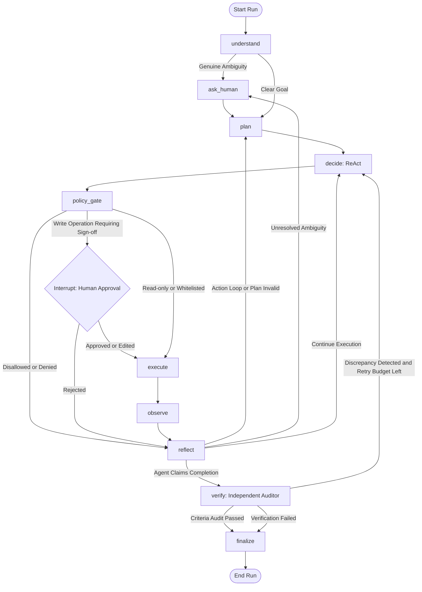
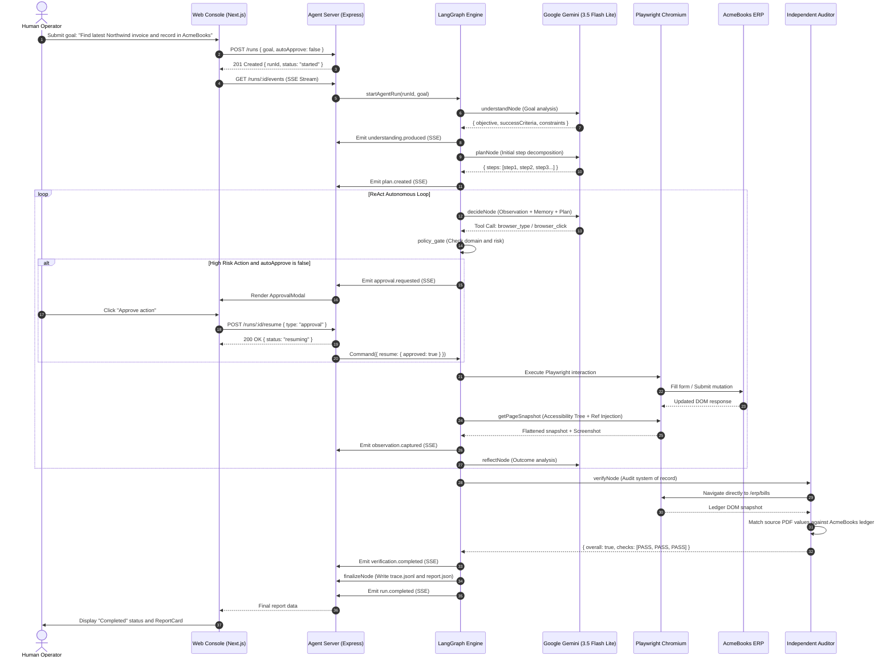

# CentrAlign Autonomous AI Task Worker Architecture

## 1. System Overview

The CentrAlign Autonomous Task Worker is an enterprise-grade agent built to complete natural-language workflows across third-party portals, document sources, internal company systems (ERPs), and file systems without human handholding.

### Core Architectural Principles
1. Zero Task-Specific Code in Control Flow: The state machine and graph edges are 100% domain-agnostic. Task-specific instructions exist solely in system prompts, tool specifications, and the environment DOM. The exact same graph processes invoice entries, payment ledger reconciliations, read-only queries, and data extraction.
2. ReAct with Explicit Rationale: Every decision outputs both a tool call and an operator-facing rationale explaining why the model selected that action.
3. Deterministic Safety Policy Gate: High-risk write operations (such as submitting forms or executing payments) are intercepted by a deterministic code policy before execution. If configured, actions pause via LangGraph interrupts until a human operator signs off.
4. Independent Verification Auditor: The agent can only claim success; an isolated, dedicated verifier node re-opens the system of record with read-only tools and compares the registered data against source documents.
5. DOM-Ref Accessibility Snapshots: Instead of relying on brittle pixel coordinates or heavy multi-modal screenshot tokens for every interaction, the system flattens the page accessibility and interactive elements tree into discrete, numbered agent references ([e1], [e2], etc.) injected into the live DOM.

---

## 2. LangGraph State Machine Architecture

The core agent loop implements:
Goal -> Understand -> Plan -> Execute -> Observe -> Adapt -> Verify -> Complete



---

## 3. Node Specifications

### 1. understand
- Purpose: Analyzes the raw goal and produces a zod-validated Understanding object.
- Infers Implicit Expectations:
  - Latest requires sorting by chronological Issue Date rather than table column order.
  - Enter into internal system directs actions to the AcmeBooks ERP ledger (/erp/bills).
  - Requires DD/MM/YYYY format for company dates.
  - Anchors relative dates against the current system date.
- Outputs: Explicit, checkable success criteria, operational constraints, missing information, and risk level (low, medium, high).
- Escalation: If critical information is missing or contradictory (for example a Draft invoice with a newer date than an Issued invoice), it routes to ask_human.

### 2. plan
- Purpose: Produces a 3 to 8 step living plan.
- Revisability: Mid-run reflections can trigger replanning without restarting the execution state.

### 3. decide (ReAct Step)
- Purpose: Evaluates understanding, living plan, key-value memory, and the latest observation snapshot, choosing exactly ONE tool call or finish.
- Budget Hard Cap: Enforces a configurable cap (default 25 tool calls) to protect token budgets and prevent infinite execution.
- Loop Detection: Evaluates recent actions. If identical tool calls and arguments are repeated, it triggers self-correction.

### 4. policy_gate
- Deterministic Code Guardrail: Evaluated in deterministic JavaScript code, not by an LLM.
- Allowed Domain Check: Verifies URLs against allowedDomains (localhost, 127.0.0.1). Blocks external origin exfiltration.
- Write Operation Interception: When policy.requireApprovalForWrites is active, any action submitting records triggers a LangGraph interrupt().
- Interrupt Resume: Human operators can approve, reject, or edit proposed form values directly from the web console.

### 5. execute
- Purpose: Dispatches tool call with timeout boundary and secret masking.
- Exception Isolation: Never throws unhandled errors; returns structured result objects with durationMs and status.

### 6. observe
- Purpose: Captures current URL, title, DOM accessibility ref tree ([e1], [e2]), active alert notices, table rows, and evidence screenshots.

### 7. reflect
- Purpose: Analyzes failure signals:
  - Transient HTTP 500 error detection (backs off and retries).
  - Validation error notices (dates, amounts).
  - Pre-existing duplicate banners.
- Routing: Directs next state to continue, retry_same, replan, ask_human, or verify.

### 8. verify (Independent Auditor)
- Dedicated Auditor Loop: Operates with restricted read-only tools and an independent auditor prompt: "Do not trust previous claims. Re-open the system of record and confirm each success criterion with direct evidence."
- Cross-Check: Re-extracts ground-truth figures directly from the source PDF and verifies exact values entered into AcmeBooks ERP.
- Corrective Context: If an audit fails and verification retries remain (maximum 2), it routes back to decide with corrective instructions.

### 9. finalize
- Purpose: Compiles structured JSONL trace, evidence screenshots, extracted data records, and generates downloadable JSON and HTML reports.

---

## 4. Agent State Shape

The LangGraph state channels are typed with Zod schemas:

```javascript
export const AgentStateChannels = {
  runId: { value: (x, y) => y ?? x, default: () => '' },
  goal: { value: (x, y) => y ?? x, default: () => '' },
  understanding: { value: (x, y) => y ?? x, default: () => null },
  plan: { value: (x, y) => y ?? x, default: () => [] },
  history: { value: (x, y) => (x || []).concat(y || []), default: () => [] },
  lastAction: { value: (x, y) => y ?? x, default: () => null },
  lastToolResult: { value: (x, y) => y ?? x, default: () => null },
  lastObservation: { value: (x, y) => y ?? x, default: () => null },
  memory: { value: (x, y) => ({ ...(x || {}), ...(y || {}) }), default: () => ({}) },
  evidence: { value: (x, y) => (x || []).concat(y || []), default: () => [] },
  policyDecision: { value: (x, y) => y ?? x, default: () => null },
  verification: { value: (x, y) => y ?? x, default: () => null },
  toolCallsCount: { value: (x, y) => (typeof y === 'number' ? y : (x || 0) + 1), default: () => 0 },
  failureCount: { value: (x, y) => (typeof y === 'number' ? y : (x || 0)), default: () => 0 },
  status: { value: (x, y) => y ?? x, default: () => 'running' },
  error: { value: (x, y) => y ?? x, default: () => null },
};
```

---

## 5. Tool Registry Specification

| Tool Name | Category | Risk Level | Description |
| :--- | :--- | :--- | :--- |
| `browser_goto` | Navigation | Low | Navigate to an allowlisted internal URL. |
| `browser_click` | Interaction | Medium | Click an interactive element by reference tag (for example e3). |
| `browser_type` | Interaction | Medium | Type text or masked secret into an input element. |
| `browser_select` | Interaction | Medium | Select an option in a HTML select dropdown. |
| `browser_download` | File System | Low | Click a download link and save file safely into run workspace. |
| `browser_snapshot` | Observation | Low | Capture live DOM accessibility tree and screenshot. |
| `pdf_extract_fields` | Extraction | Low | Extract text and key-value fields from a downloaded PDF file. |
| `file_read` | File System | Low | Read local file content strictly within the workspace directory. |
| `save_memory` | Memory | Low | Persist extracted business data with provenance into agent memory. |
| `ask_human` | Interaction | Low | Pause execution to request clarification on ambiguous goals. |
| `finish` | Control | Low | Submit claimed task completion to the independent verification auditor. |

---

## 6. End-to-End Sequence Diagram


