# CentrAlign Autonomous AI Task Worker: Architecture & Design

## 1. System Overview

The **CentrAlign Autonomous Task Worker** is an enterprise-grade agent built to complete natural-language workflows across third-party portals, document sources, internal company systems (ERPs), and file systems without human handholding.

### Core Architectural Principles
1. **Zero Task-Specific Code in Control Flow:** The state machine and graph edges are 100% domain-agnostic. Task-specific instructions exist solely in system prompts, tool specifications, and the environment DOM. The exact same graph processes invoice entries, payment ledger reconciliations, read-only queries, and data extraction.
2. **ReAct with Explicit Rationale:** Every decision outputs both a tool call and an operator-facing rationale explaining *why* the model selected that action.
3. **Deterministic Safety Policy Gate:** High-risk write operations (such as submitting forms or executing payments) are intercepted by a deterministic code policy before execution. If configured, actions pause via LangGraph interrupts until a human operator signs off.
4. **Independent Verification Auditor:** The agent can only *claim* success; an isolated, dedicated verifier node re-opens the system of record with read-only tools and compares the registered data against source documents.
5. **DOM-Ref Accessibility Snapshots:** Instead of relying on brittle pixel coordinates or heavy multi-modal screenshot tokens for every interaction, the system flattens the page's accessibility and interactive elements tree into discrete, numbered agent references (`[e1]`, `[e2]`, etc.) injected into the live DOM.

---

## 2. LangGraph State Machine Architecture

The core agent loop implements:
$$\text{Goal} \longrightarrow \text{Understand} \longrightarrow \text{Plan} \longrightarrow \text{Execute} \longrightarrow \text{Observe} \longrightarrow \text{Adapt} \longrightarrow \text{Verify} \longrightarrow \text{Complete}$$

```mermaid
flowchart TD
    START([Start Run]) --> NodeUnderstand[understand]
    NodeUnderstand -->|Genuine Ambiguity| NodeAskHuman[ask_human]
    NodeAskHuman --> NodePlan[plan]
    NodeUnderstand -->|Clear Goal| NodePlan

    NodePlan --> NodeDecide[decide (ReAct)]
    NodeDecide --> NodePolicyGate[policy_gate]

    NodePolicyGate -->|Disallowed / Denied| NodeReflect[reflect]
    NodePolicyGate -->|Write Operation Requiring Sign-off| InterruptApproval{Interrupt: Human Approval}
    InterruptApproval -->|Approved / Edited| NodeExecute[execute]
    InterruptApproval -->|Rejected| NodeReflect

    NodePolicyGate -->|Read-only / Whitelisted| NodeExecute
    NodeExecute --> NodeObserve[observe]
    NodeObserve --> NodeReflect

    NodeReflect -->|Action Loop or Plan Invalid| NodePlan
    NodeReflect -->|Unresolved Ambiguity| NodeAskHuman
    NodeReflect -->|Continue Execution| NodeDecide
    NodeReflect -->|Agent Claims Completion| NodeVerify[verify (Independent Auditor)]

    NodeVerify -->|Criteria Audit Passed| NodeFinalize[finalize]
    NodeVerify -->|Discrepancy Detected & Retry Budget Left| NodeDecide
    NodeVerify -->|Verification Failed| NodeFinalize
    NodeFinalize --> END([End Run])
```

---

## 3. Node Specifications

### 1. `understand`
- **Purpose:** Analyzes the raw goal and produces a zod-validated `Understanding` object.
- **Infers Implicit Expectations:**
  - "Latest" requires sorting by chronological Issue Date rather than table column order.
  - "Enter into internal system" directs actions to the AcmeBooks ERP ledger.
  - Requires `DD/MM/YYYY` format for company dates.
- **Outputs:** Explicit, checkable success criteria, operational constraints, missing information, and risk level (`low`, `medium`, `high`).
- **Escalation:** If critical information is missing or contradictory (e.g. a Draft invoice with a newer date than an Issued invoice), it routes to `ask_human`.

### 2. `plan`
- **Purpose:** Produces a 3 to 8 step living plan.
- **Revisability:** Mid-run reflections can trigger replanning without restarting the execution state.

### 3. `decide` (ReAct Step)
- **Purpose:** Evaluates understanding, living plan, key-value memory, and the latest observation snapshot, choosing exactly ONE tool call or `finish`.
- **Budget Hard Cap:** Enforces a configurable cap (default 25 tool calls) to protect token budgets and prevent infinite execution.
- **Loop Detection:** Evaluates the last 3 actions. If identical tool calls and arguments are repeated, it triggers self-correction.

### 4. `policy_gate`
- **Deterministic Code Guardrail:** Not judged by an LLM.
- **Allowed Domain Check:** Verifies URLs against `allowedDomains` (`localhost`, `127.0.0.1`). Blocks external origin exfiltration.
- **Write Operation Interception:** When `policy.requireApprovalForWrites` is active, any action submitting records triggers a LangGraph `interrupt()`.
- **Interrupt Resume:** Human operators can approve, reject, or edit proposed form values directly from the web console.

### 5. `execute`
- **Purpose:** Dispatches tool call with timeout boundary and secret masking.
- **Exception Isolation:** Never throws unhandled errors; returns structured `{ ok, result | error, durationMs }`.

### 6. `observe`
- **Purpose:** Captures current URL, title, DOM accessibility ref tree (`[e1]`, `[e2]`), active alert notices, table rows, and evidence screenshots.

### 7. `reflect`
- **Purpose:** Analyzes failure signals:
  - Transient HTTP 500 error detection (backs off and retries).
  - Validation error notices (dates, amounts).
  - Pre-existing duplicate banners.
- **Routing:** Directs next state to `continue`, `retry_same`, `replan`, `ask_human`, or `verify`.

### 8. `verify` (Independent Auditor)
- **Dedicated Auditor Loop:** Operates with restricted read-only tools and an independent auditor prompt: *"Do not trust previous claims. Re-open the system of record and confirm each success criterion with direct evidence."*
- **Cross-Check:** Re-extracts ground-truth figures directly from the source PDF and verifies exact values entered into AcmeBooks ERP.
- **Corrective Context:** If an audit fails and verification retries remain (max 2), it routes back to `decide` with corrective instructions.

### 9. `finalize`
- **Purpose:** Compiles structured JSONL trace, evidence screenshots, extracted data records, and generates downloadable JSON & HTML reports.

### 10. `ask_human`
- **Purpose:** Pauses the graph using LangGraph's checkpointer to solicit clarification from the operator. Resumes upon answer.

---

## 4. End-to-End Sequence Diagram

```mermaid
sequenceDiagram
    autonumber
    actor User as Operator / Console
    participant Agent as LangGraph Workflow
    participant Policy as Policy Gate
    participant Browser as Playwright Browser
    participant Files as PDF & File Tools
    participant ERP as AcmeBooks ERP (SQLite)
    participant Verifier as Independent Auditor

    User->>Agent: "Find latest invoice from Northwind Traders and enter into AcmeBooks"
    Agent->>Agent: understand (generate success criteria)
    Agent->>Agent: plan (formulate 6-step checklist)
    
    rect rgb(20, 25, 40)
    Note over Agent,Browser: ReAct Discovery & Extraction Cycle
    Agent->>Browser: browser_goto(/portal/vendors)
    Browser-->>Agent: Observation ([e4] link "View Invoices for Northwind Traders")
    Agent->>Browser: browser_click(e4)
    Browser-->>Agent: Invoices table (sorted by invoice_no, Page 1: INV-1001..INV-1030)
    Agent->>Browser: browser_click([e8] "Next page →")
    Browser-->>Agent: Page 2 showing latest issued invoice INV-1042
    Agent->>Browser: browser_download([e3] Download PDF)
    Browser-->>Files: Saves INV-1042.pdf into workspace
    Agent->>Files: pdf_extract_fields(INV-1042.pdf)
    Files-->>Agent: Extracted: $12,450.00, Due: 15/12/2026, Vendor: Northwind Traders
    end

    rect rgb(25, 35, 30)
    Note over Agent,ERP: System of Record Entry & Human Sign-off
    Agent->>Browser: browser_goto(/erp/bills)
    Agent->>Browser: browser_click("Create New Bill")
    Agent->>Browser: browser_select(Vendor), browser_type(Dates, Amount)
    Agent->>Policy: Propose browser_click("Submit Bill")
    Policy->>User: LangGraph Interrupt: Human Approval Required
    User-->>Policy: Approve Action
    Policy->>Browser: Execute Form Submit
    Browser->>ERP: HTTP POST /erp/api/bills
    ERP-->>Browser: Redirect /erp/bills/bill_xxx (Green Banner: "Bill created")
    Agent->>Agent: Propose finish()
    end

    rect rgb(30, 25, 35)
    Note over Verifier,ERP: Independent Ground-Truth Verification
    Agent->>Verifier: Audit claimed completion against success criteria
    Verifier->>Browser: Navigate directly to /erp/bills and /erp/bills/bill_xxx
    Verifier->>Files: Re-read INV-1042.pdf
    Verifier->>ERP: Query database ledger records
    Verifier-->>Agent: All 5 success criteria PASS with direct evidence
    end

    Agent->>User: Task autonomously completed & independently verified
```



---

## 5. Security & Isolation Model

| Surface | Risk | Defensive Implementation |
|:--------|:-----|:-------------------------|
| **Origin Whitelist** | SSRF, URL Exfiltration | `isAllowedDomain()` restricts navigation to `localhost` and `127.0.0.1`. External origins are blocked. |
| **Credential Masking** | Trace / Log Leakage | Secrets (`PORTAL_PASSWORD`, `ERP_PASSWORD`) use template substitution `{{secret:KEY}}` at runtime and are masked with `******` across all JSONL logs and screenshots. |
| **Path Traversal** | Filesystem Tampering | `resolveSafePath()` restricts all file operations to `/apps/agent/runs/<runId>/workspace`. Traversal attempts throw security violations. |
| **Prompt Injection** | Malicious Vendor PDFs | Documents and web pages are treated strictly as untrusted DATA. Deterministic policy gates prevent unauthorized mutations regardless of LLM text outputs. |
